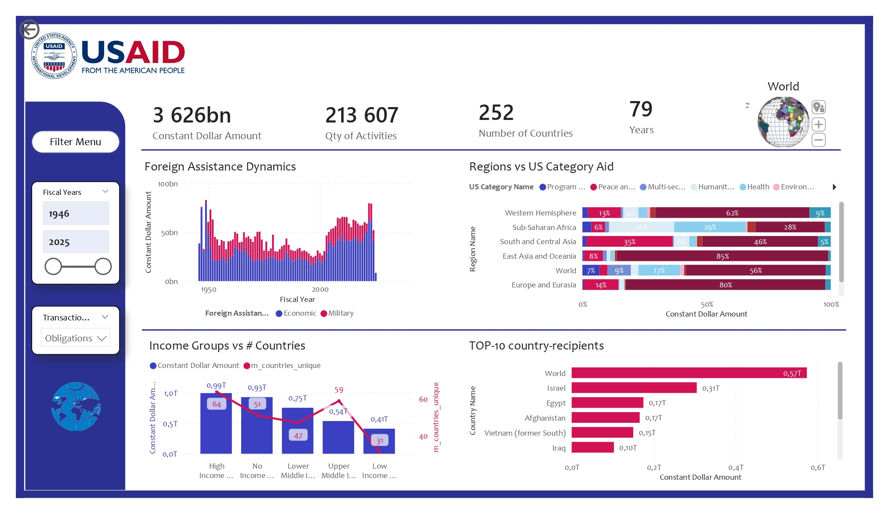
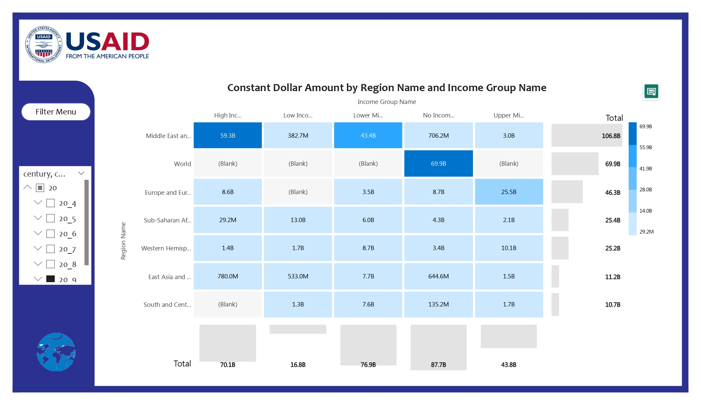
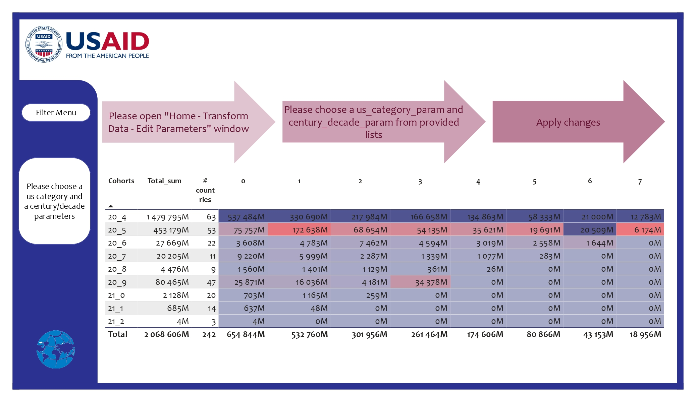
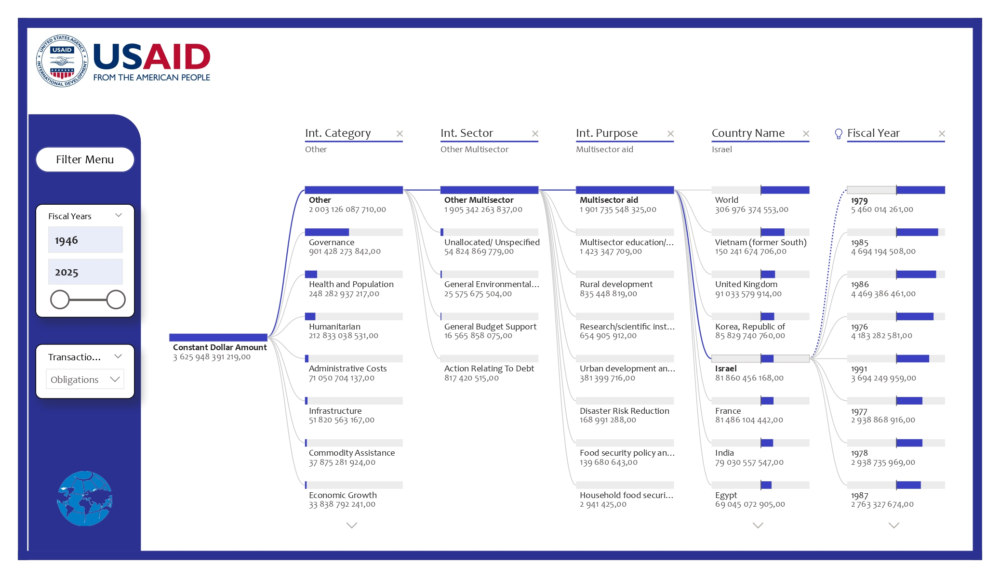
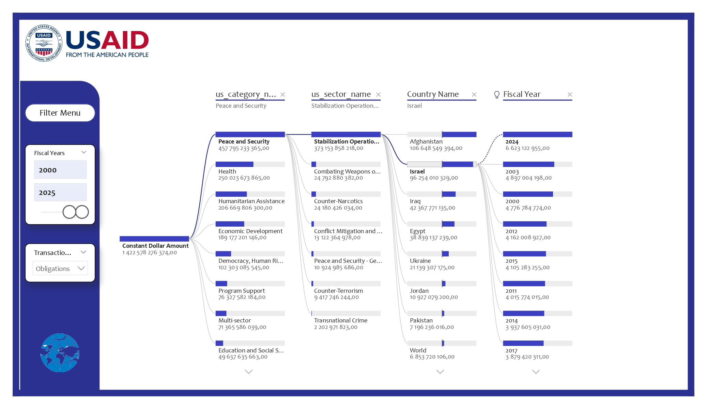
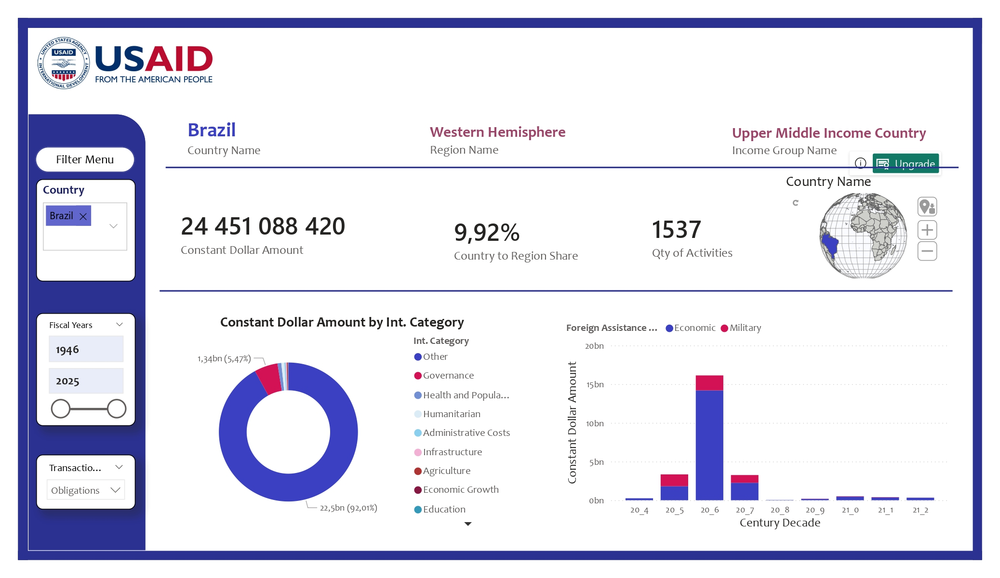
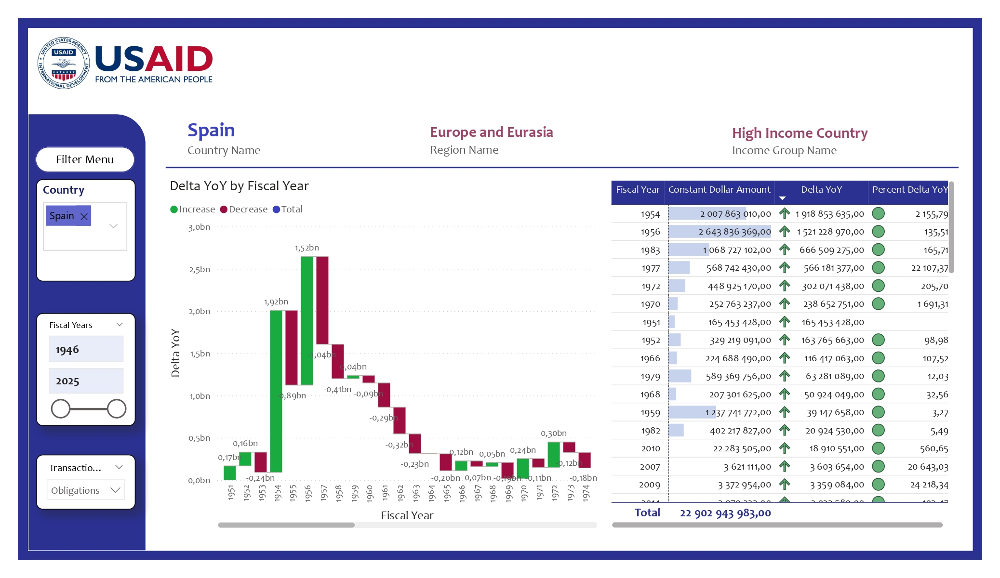
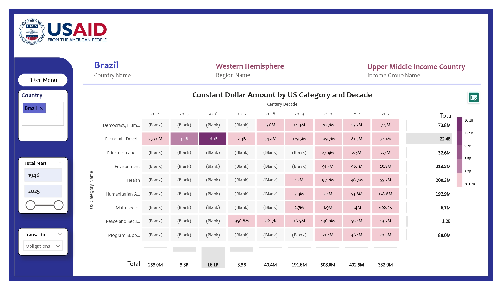
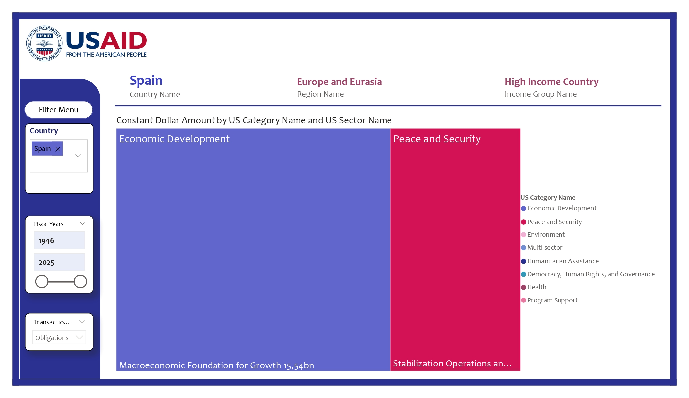

# Subproject ANALYSIS
This subproject offers you a thorouhg analysis of USAID data.

Here you can find a link to the Power BI Report: https://disk.yandex.ru/d/MhwWyfyMdegc6Q .
Since this file is ~125 Mb, let the report be in pdf format on GitHub.
Besides let's display these images here:

